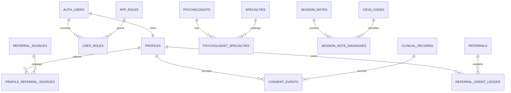

# Arquitectura de datos WiseLife

## Alcance

Modelo incremental para PostgreSQL/Supabase, compatible con las tablas existentes y sin eliminación de columnas legacy. La migración `supabase/migrations/20260807000100_wiselife_data_architecture.sql` queda versionada para revisión; no fue ejecutada contra el proyecto Supabase conectado.

## Estado base auditado

El proyecto contiene `profiles`, `emotional_diary`, `referrals`, `favorite_specialties`, `psychologists`, `psychologist_availability`, `schedule_blocks`, `appointments`, `clinical_records`, `session_notes`, `cie10_codes` y `payment_transactions`. La migración agrega las entidades normalizadas y refuerza los accesos sin romper los datos existentes.

## Modelo lógico

## Tablas nuevas

| Tabla | Propósito | Clave | Regla principal |
|---|---|---|---|
| `app_roles` | Catálogo de autorización | `code` | Solo catálogo; nunca usar `user_metadata` para permisos |
| `user_roles` | Asignación usuario-rol | `(user_id, role_code)` | Administración restringida a `admin` |
| `referral_sources` | Catálogo normalizado de referidos | `id` | Reemplaza gradualmente el array legacy |
| `profile_referral_sources` | Relación perfil-fuente | `(profile_id, referral_source_id)` | El usuario solo administra sus asociaciones |
| `specialties` | Catálogo de especialidades | `id` | Lectura autenticada; mutación administrativa |
| `psychologist_specialties` | Relación profesional-especialidad | `(psychologist_id, specialty_id)` | Escritura solo por el profesional dueño |
| `session_note_diagnoses` | Diagnósticos normalizados | `(session_note_id, cie10_code)` | Un diagnóstico primario por nota |
| `consent_events` | Historial de consentimiento | `id` | Registro histórico, no sobrescribir aceptación previa |
| `private.clinical_audit_events` | Auditoría clínica | `id` identity | Solo lectura administrativa; no expuesto por PostgREST |
| `referral_credit_ledger` | Ledger inmutable de créditos | `id` identity | `idempotency_key` único; saldo de perfil es cache derivada |

## Relaciones y llaves foráneas

- Las entidades de usuario apuntan a `auth.users(id)` con `ON DELETE CASCADE` solo para asignaciones derivadas de identidad.
- Los datos clínicos apuntan a `profiles`, `psychologists`, `clinical_records`, `session_notes` y `cie10_codes` con `ON DELETE RESTRICT` cuando la retención legal exige conservar evidencia.
- Las tablas puente usan `ON DELETE CASCADE` desde la entidad dueña y `ON DELETE RESTRICT` sobre catálogos.
- Los ledger y consentimientos no se eliminan automáticamente al borrar un perfil.

## Índices y rendimiento

Los índices siguen los patrones de consulta por usuario/profesional, estado y fecha: agendas descendentes por fecha, notas por historia clínica, pagos por estado, auditoría por recurso y ledger por perfil. Los nombres son explícitos y usan `CREATE INDEX IF NOT EXISTS` para evitar duplicados por nombre.

En producción, los índices grandes deben aplicarse con `CREATE INDEX CONCURRENTLY` en una migración separada no transaccional. No se particionan prematuramente tablas pequeñas; al superar decenas de millones de filas, particionar `session_notes`, `clinical_audit_events`, `emotional_diary` y `payment_transactions` por mes o trimestre usando la fecha de negocio. Mantener retención y archivado fuera de las rutas OLTP.

## RLS

Todas las tablas nuevas tienen RLS habilitado. Las políticas:

- usan `TO authenticated` y `(select auth.uid())`;
- separan `USING` y `WITH CHECK` para impedir reasignaciones de propietario;
- validan la relación padre en diagnósticos y especialidades;
- permiten lectura de catálogos a usuarios autenticados;
- reservan administración de roles a `private.has_app_role('admin')`;
- impiden mutaciones directas del ledger y de la auditoría;
- no dependen de claims editables en `raw_user_meta_data`.

La función auxiliar es `SECURITY DEFINER`, tiene `set search_path = ''`, referencias cualificadas y permisos revocados para `public`; se utiliza únicamente porque la política de `user_roles` necesita consultar la propia tabla sin recursión RLS.

## Compatibilidad incremental

No se eliminan `profiles.referral_sources`, `profiles.referral_credits`, `psychologists.specialties`, diagnósticos legacy ni flags de consentimiento. La carga inicial de tablas puente debe ejecutarse como una migración de datos separada, después de revisar duplicados y normalización de códigos. Los flags legacy deben actualizarse desde las nuevas relaciones/ledger mediante procesos servidores, nunca por escritura directa del cliente.

## Operación y validación

Antes de aplicar:

1. Comparar tablas, columnas, restricciones, índices y políticas contra el entorno destino.
2. Resolver filas que incumplan las restricciones `NOT VALID` de horarios.
3. Aplicar la migración en una ventana controlada y validar con `pg_constraint`, `pg_indexes`, `pg_policies` y `information_schema`.
4. Ejecutar Supabase advisors y corregir advertencias de seguridad/performance.
5. Generar tipos Supabase después de la migración.

La rama de trabajo es `arq_db`; la migración no se aplicó remotamente en esta entrega.
