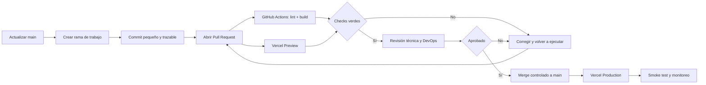
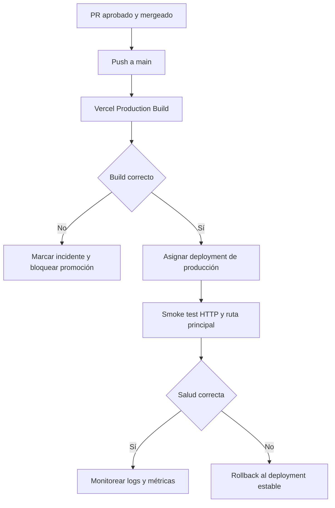
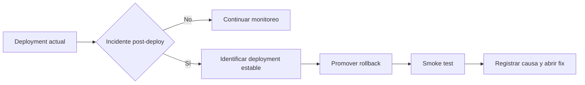

# Flujo CI/CD de WiseLife

## 1. Propósito y alcance

Este documento define el flujo operativo para integrar GitHub, Pull Requests, GitHub Actions y Vercel. El alcance es exclusivamente DevOps: automatización, calidad, seguridad, despliegues, variables, optimización, observabilidad y recuperación. No autoriza el desarrollo de funcionalidades de negocio.

**Estado de referencia:** `main` es la rama de producción y `dev_ops` es la rama de trabajo de esta entrega.

### Objetivos

- Mantener `main` siempre desplegable y trazable.
- Ejecutar validaciones reproducibles antes de integrar cambios.
- Crear previews aisladas para cada Pull Request.
- Promover a producción únicamente mediante merge aprobado en `main`.
- Separar secretos y configuración por ambiente.
- Reducir riesgo operativo con rollback documentado y permisos mínimos.

### Responsabilidades

| Rol | Responsabilidad |
|---|---|
| DevOps WiseLife | Configurar GitHub, Actions, Vercel, variables, despliegues, observabilidad y runbooks. |
| Autor del cambio | Crear rama, mantener alcance, atender checks y responder revisiones. |
| Revisor | Validar arquitectura, seguridad, impacto operativo y criterios de aceptación. |
| Vercel | Ejecutar builds, previews, producción y conservar historial de despliegues. |
| GitHub Actions | Ejecutar lint, typecheck/build y controles automatizados. |

## 2. Estrategia de ramas

| Rama o patrón | Uso | Despliegue |
|---|---|---|
| `main` | Producción, protegida y siempre estable. | Production automático en Vercel. |
| `feature/<descripcion>` | Trabajo funcional aprobado por el equipo. | Preview por PR. |
| `fix/<descripcion>` | Corrección no urgente. | Preview por PR. |
| `chore/<descripcion>` | Mantenimiento, dependencias o tooling. | Preview por PR. |
| `hotfix/<descripcion>` | Corrección crítica coordinada. | Preview y promoción controlada. |
| `dev_ops` | Cambios operativos y documentación DevOps. | Preview si se conecta como rama no productiva. |

Reglas:

1. No se trabaja directamente sobre `main`.
2. Toda rama parte de `main` actualizado.
3. El nombre debe ser corto, descriptivo y en kebab-case.
4. Una rama debe representar un objetivo operativo coherente.
5. Antes de abrir PR se sincroniza con `main` y se resuelven conflictos localmente.
6. Se eliminan ramas fusionadas, excepto ramas operativas permanentes previamente acordadas.

## 3. Flujo Pull Request



### Reglas del PR

- Título con intención clara: `docs(devops): define flujo CI/CD`.
- Descripción con objetivo, archivos afectados, riesgos, validaciones y rollback.
- Un revisor obligatorio como mínimo; dos para cambios de seguridad, producción o variables.
- Checks obligatorios: instalación reproducible, lint y build.
- No se aceptan secretos, dumps, `.env*`, tokens ni credenciales en el diff.
- No se hace merge con checks pendientes o fallidos.
- Preferir squash merge para conservar una historia lineal y revertible.
- El PR debe incluir evidencia de validación y confirmar que no cambia lógica de negocio cuando el alcance es DevOps.

## 4. CI con GitHub Actions

El repositorio dispone de scripts Vite para `lint` y `build`. El pipeline recomendado es:

1. `checkout` del commit exacto del PR.
2. Configuración de Node según la versión fijada por el repositorio.
3. Instalación reproducible con `npm ci` y lockfile obligatorio.
4. `npm run lint`.
5. `npm run build` — incluye el typecheck configurado por el proyecto.
6. Publicación del resultado como estado del PR.

Ejemplo de workflow propuesto para `.github/workflows/ci.yml`:

```yaml
name: CI

on:
  pull_request:
    branches: [main]
  push:
    branches: [main]

permissions:
  contents: read

concurrency:
  group: ci-${{ github.workflow }}-${{ github.ref }}
  cancel-in-progress: true

jobs:
  validate:
    runs-on: ubuntu-latest
    timeout-minutes: 15
    steps:
      - name: Checkout
        uses: actions/checkout@v4

      - name: Setup Node
        uses: actions/setup-node@v4
        with:
          node-version-file: .nvmrc
          cache: npm

      - name: Install dependencies
        run: npm ci

      - name: Lint
        run: npm run lint

      - name: Build
        run: npm run build
```

Antes de activarlo, se debe confirmar que `.nvmrc` existe o sustituir `node-version-file` por una versión fijada en la política del repositorio. No se deben imprimir variables, tokens ni contenido de archivos de entorno en logs.

### Seguridad del workflow

- Usar `permissions: contents: read` por defecto.
- Fijar versiones mayores de actions y actualizar mediante PR.
- No usar `pull_request_target` para ejecutar código no confiable del PR.
- No exponer secretos a workflows de forks.
- Definir `timeout-minutes` y cancelar ejecuciones obsoletas.
- Separar jobs de validación de cualquier job que tenga permisos de publicación.
- Añadir Dependabot para GitHub Actions y dependencias npm.

## 5. Integración GitHub–Vercel

### Preview

Cada PR contra `main` crea un despliegue Preview con URL única. El preview debe utilizar variables del ambiente **Preview**, permitir revisión visual y servir como evidencia antes del merge. Los comentarios de Vercel en el PR deben quedar habilitados para que la URL sea visible junto con el estado del build.

### Production

La rama `main` debe estar configurada como Production Branch en Vercel. El despliegue de producción ocurre únicamente después del merge a `main`; no se deben usar despliegues manuales desde una rama de trabajo para reemplazar producción.



### Promoción y rollback

Vercel conserva deployments anteriores. Para rollback:

1. Confirmar síntoma, alcance y deployment afectado.
2. Detener la promoción de cambios adicionales.
3. Seleccionar el último deployment estable identificado por commit.
4. Promoverlo como producción desde Vercel.
5. Ejecutar smoke test y registrar incidente.
6. Abrir un PR correctivo; nunca editar producción manualmente sin trazabilidad.



## 6. Variables y ambientes

Las variables se gestionan en Vercel, nunca en el repositorio. Deben existir sólo en el ambiente que las necesita:

| Variable | Development | Preview | Production | Tratamiento |
|---|---:|---:|---:|---|
| `VITE_SUPABASE_URL` | Sí | Sí | Sí | Configuración no secreta; validar proyecto correcto por ambiente. |
| `VITE_SUPABASE_ANON_KEY` | Sí | Sí | Sí | Pública para cliente, pero restringida por RLS. |
| `SUPABASE_URL` | Según backend | Según backend | Según backend | No exponer al bundle del navegador. |
| `SUPABASE_SERVICE_ROLE_KEY` | Sólo operaciones locales autorizadas | No por defecto | Sólo servidor protegido | Secreto crítico; nunca `VITE_`, logs ni cliente. |
| `VITE_NEQUI_PHONE` | Sí | Sí | Sí | Validar que cada ambiente use el valor esperado. |

La matriz debe revisarse en cada cambio de infraestructura. Las variables de Preview no deben apuntar accidentalmente a producción. Después de rotar un secreto, redeployar el ambiente correspondiente y validar que el valor anterior ya no funciona.

## 7. Optimización

### CI

- Usar `npm ci` y caché de npm mediante `setup-node`.
- Cancelar ejecuciones antiguas por rama/PR.
- Evitar jobs duplicados y pasos que no aporten una señal de calidad.
- Mantener Node, npm y actions fijados y documentados.
- Medir duración del build; investigar regresiones superiores al 20%.

### Vercel y frontend

- Mantener el build command en `npm run build` y el output compatible con Vite.
- No incluir secretos en variables `VITE_*`.
- Revisar bundle y dependencias cuando aumente el tamaño de salida.
- Usar headers de caché sólo para assets versionados; no cachear respuestas sensibles.
- Configurar dominio, redirects y rewrites desde Vercel de forma versionada cuando sea posible.
- Validar preview en móvil y desktop antes de aprobar cambios visuales.
- Definir como objetivo operativo evitar regresiones de LCP, CLS e INP; medir en despliegues relevantes.

### Observabilidad

- Conservar logs de build y deployment en Vercel.
- No registrar datos clínicos, tokens, secretos ni información personal innecesaria.
- Etiquetar incidentes con commit, deployment URL, ambiente y hora UTC.
- Revisar errores de runtime inmediatamente después de una promoción.

## 8. Docker: criterio de uso

WiseLife es un frontend Vite estático. Docker no es necesario para el despliegue normal en Vercel y añadirlo por defecto incrementaría complejidad y tiempo de build. Se justifica sólo si se requiere paridad local estricta, ejecución en un proveedor containerizado, proxy adicional o un proceso servidor que Vercel no cubra.

Si se necesita, usar una imagen multi-stage, usuario no root, dependencias reproducibles, `.dockerignore` y healthcheck. La imagen final debe contener únicamente el artefacto servido y el servidor web necesario; nunca secretos ni `node_modules` de desarrollo.

## 9. Protección y gobierno

- Proteger `main`: PR obligatorio, checks obligatorios, revisión obligatoria y prohibición de push directo.
- Requerir branches actualizadas antes del merge.
- Desactivar force-push y borrado de `main`.
- Activar secret scanning y Dependabot.
- Revisar accesos de GitHub y Vercel trimestralmente.
- Mantener separación Development/Preview/Production.
- Usar SSO/MFA donde el plan lo permita.
- Conceder permisos mínimos a GitHub Actions y tokens de Vercel.
- Registrar cambios de configuración de Vercel, dominios, variables y protección de ramas.

## 10. Runbooks

### CI falla

1. Abrir el job fallido y capturar el primer error real.
2. Reproducir con `npm ci`, `npm run lint` y `npm run build` en el commit del PR.
3. Corregir en la misma rama y esperar una nueva ejecución.
4. No saltar checks ni hacer merge forzado.

### Variable faltante

1. Identificar ambiente y variable exacta en el log sin revelar su valor.
2. Confirmar que está configurada en Vercel para el ambiente correcto.
3. Revisar nombre, alcance y redeploy.
4. Verificar que el código no la use en cliente si es secreta.

### Deployment fallido

1. Revisar build logs de Vercel.
2. Comparar commit con el último deployment estable.
3. Corregir mediante PR o ejecutar rollback si afecta producción.
4. Ejecutar smoke test después de la recuperación.

### Incidente de producción

1. Declarar incidente, responsable y canal de coordinación.
2. Medir impacto y preservar logs.
3. Rollback si el impacto es activo y el deployment estable está identificado.
4. Rotar credenciales si existe exposición.
5. Crear postmortem con causa raíz, impacto, detección y acciones preventivas.

## 11. Checklist de configuración pendiente

### GitHub

- [ ] Proteger `main` con PR y checks obligatorios.
- [ ] Crear `.github/workflows/ci.yml` basado en el ejemplo validado.
- [ ] Confirmar versión de Node (`.nvmrc` o política equivalente).
- [ ] Activar Dependabot, secret scanning y alertas de dependencias.
- [ ] Definir revisores o `CODEOWNERS` para cambios DevOps.

### Vercel

- [ ] Confirmar repositorio conectado y `main` como Production Branch.
- [ ] Confirmar Preview deployments para Pull Requests.
- [ ] Revisar variables por Development, Preview y Production.
- [ ] Confirmar dominios, rewrites y logs de deployment.
- [ ] Documentar el deployment estable de referencia para rollback.

### Aceptación

- [ ] Todo PR contra `main` ejecuta CI y crea Preview.
- [ ] Un merge aprobado a `main` genera Production automático.
- [ ] Las variables están separadas por ambiente y no hay secretos versionados.
- [ ] Existe rollback operativo y probado.
- [ ] El equipo puede identificar commit, deployment y responsable de cualquier cambio.
