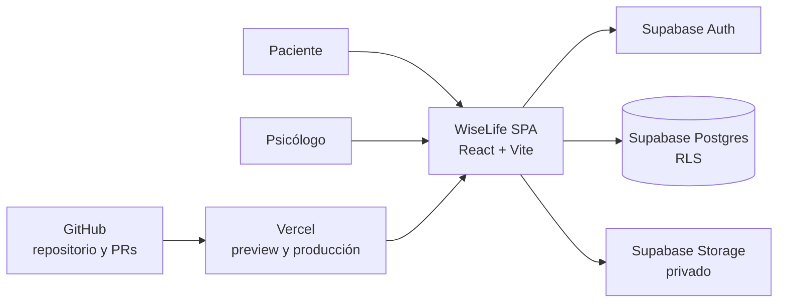

# Diagrama de contexto

```mermaid
flowchart LR
  Patient[Paciente]
  Psych[Psicólogo]
  GitHub[GitHub\nrepositorio y PRs]
  Vercel[Vercel\npreview y producción]
  App[WiseLife SPA\nReact + Vite]
  Auth[Supabase Auth]
  DB[(Supabase Postgres\nRLS)]
  Storage[Supabase Storage\nprivado]

  Patient --> App
  Psych --> App
  App --> Auth
  App --> DB
  App --> Storage
  GitHub --> Vercel
  Vercel --> App
```

GitHub controla cambios; Vercel construye y publica; Supabase es identidad, persistencia y frontera de autorización.
