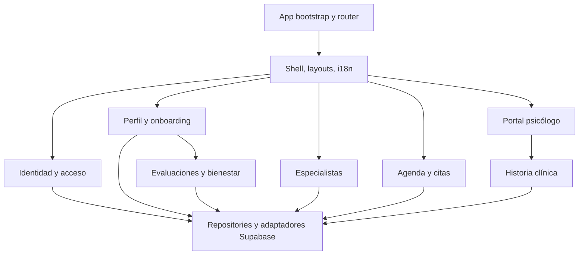

# Módulos frontend

```mermaid
flowchart TB
  App[App bootstrap y router]
  Shell[Shell, layouts, i18n]
  Auth[Identidad y acceso]
  Patient[Perfil y onboarding]
  Assess[Evaluaciones y bienestar]
  Discovery[Especialistas]
  Agenda[Agenda y citas]
  Clinical[Historia clínica]
  Psych[Portal psicólogo]
  Data[Repositories y adaptadores Supabase]

  App --> Shell
  Shell --> Auth
  Shell --> Patient
  Shell --> Discovery
  Shell --> Agenda
  Shell --> Psych
  Patient --> Assess
  Psych --> Clinical
  Auth --> Data
  Patient --> Data
  Assess --> Data
  Discovery --> Data
  Agenda --> Data
  Clinical --> Data
```

Estado actual: páginas consumen datos directamente. Objetivo: cada módulo pasa por hooks, casos de uso y repositories.
