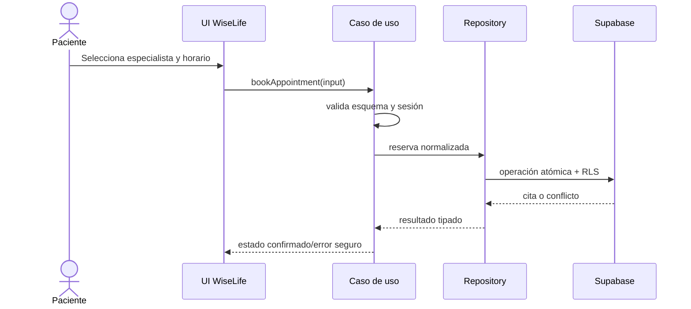
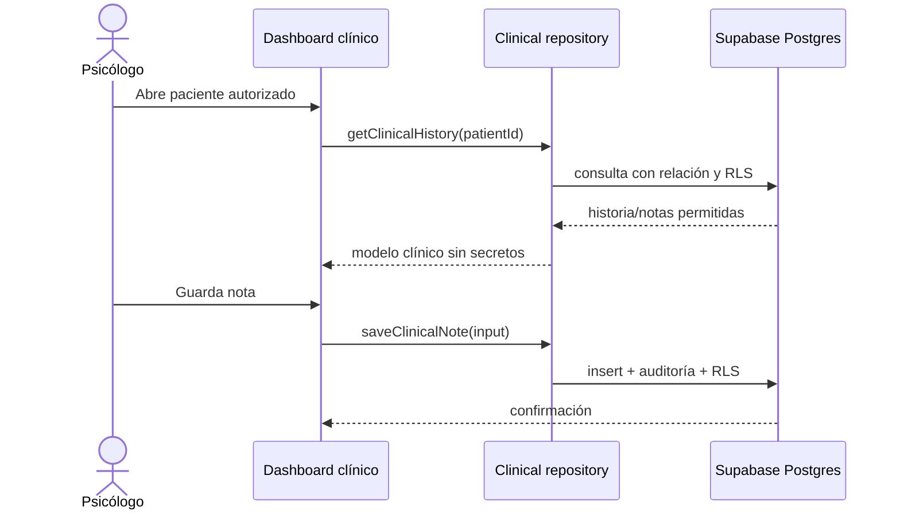

# Flujos de datos principales

## Reserva de cita

```mermaid
sequenceDiagram
  actor P as Paciente
  participant UI as UI WiseLife
  participant UC as Caso de uso
  participant R as Repository
  participant S as Supabase
  P->>UI: Selecciona especialista y horario
  UI->>UC: bookAppointment(input)
  UC->>UC: valida esquema y sesión
  UC->>R: reserva normalizada
  R->>S: operación atómica + RLS
  S-->>R: cita o conflicto
  R-->>UC: resultado tipado
  UC-->>UI: estado confirmado/error seguro
```

## Historia clínica

```mermaid
sequenceDiagram
  actor W as Psicólogo
  participant UI as Dashboard clínico
  participant R as Clinical repository
  participant DB as Supabase Postgres
  W->>UI: Abre paciente autorizado
  UI->>R: getClinicalHistory(patientId)
  R->>DB: consulta con relación y RLS
  DB-->>R: historia/notas permitidas
  R-->>UI: modelo clínico sin secretos
  W->>UI: Guarda nota
  UI->>R: saveClinicalNote(input)
  R->>DB: insert + auditoría + RLS
  DB-->>UI: confirmación
```
