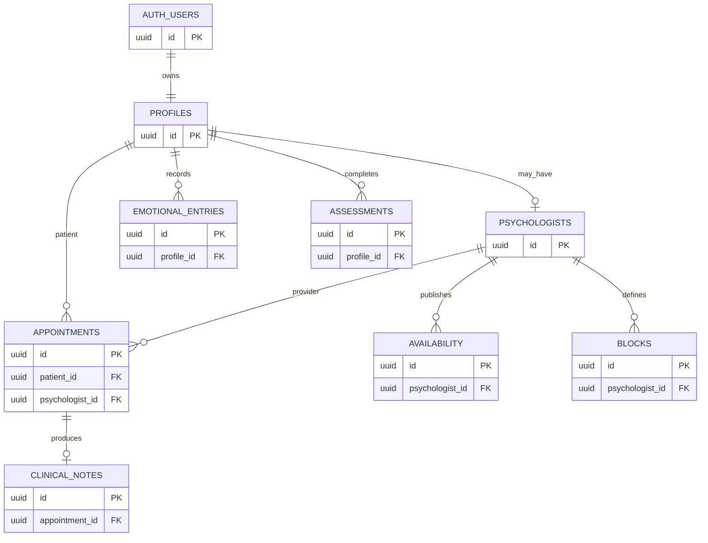

# Modelo lógico Supabase

```mermaid
erDiagram
  AUTH_USERS ||--|| PROFILES : owns
  PROFILES ||--o| PSYCHOLOGISTS : may_have
  PROFILES ||--o{ APPOINTMENTS : patient
  PSYCHOLOGISTS ||--o{ APPOINTMENTS : provider
  PSYCHOLOGISTS ||--o{ AVAILABILITY : publishes
  PSYCHOLOGISTS ||--o{ BLOCKS : defines
  APPOINTMENTS ||--o| CLINICAL_NOTES : produces
  PROFILES ||--o{ EMOTIONAL_ENTRIES : records
  PROFILES ||--o{ ASSESSMENTS : completes

  AUTH_USERS { uuid id PK }
  PROFILES { uuid id PK }
  PSYCHOLOGISTS { uuid id PK }
  APPOINTMENTS { uuid id PK uuid patient_id FK uuid psychologist_id FK }
  AVAILABILITY { uuid id PK uuid psychologist_id FK }
  BLOCKS { uuid id PK uuid psychologist_id FK }
  CLINICAL_NOTES { uuid id PK uuid appointment_id FK }
  EMOTIONAL_ENTRIES { uuid id PK uuid profile_id FK }
  ASSESSMENTS { uuid id PK uuid profile_id FK }
```

El diagrama es lógico y no sustituye el esquema vivo. Antes de implementar, verificar nombres, claves, relaciones, grants y políticas RLS reales.
