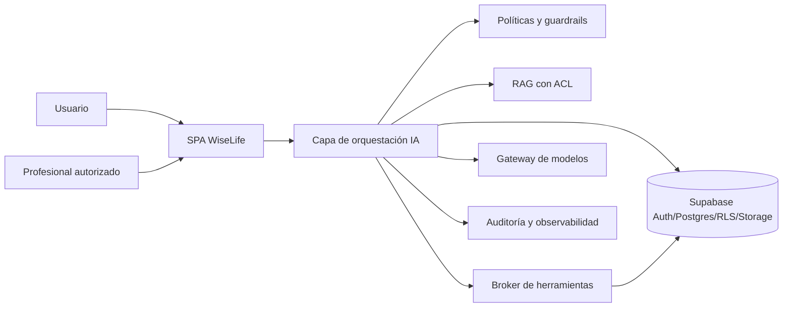
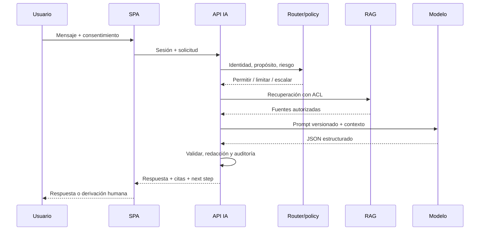
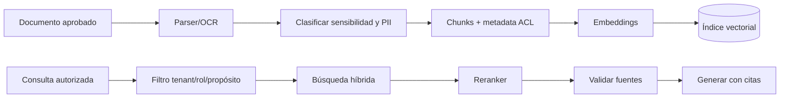
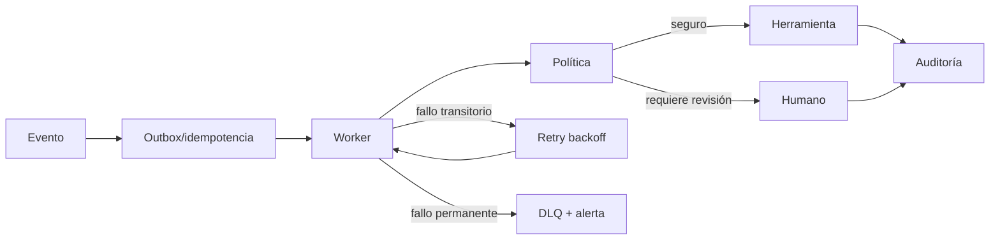
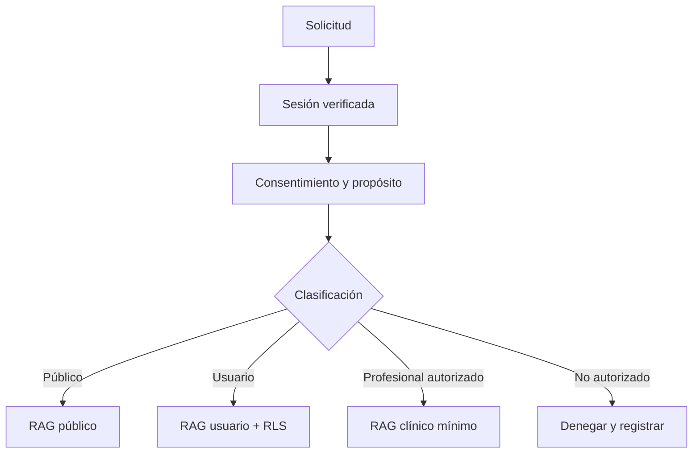

# Diagramas

## Contexto

```mermaid
flowchart LR
 U[Usuario] --> SPA[SPA WiseLife]
 P[Profesional autorizado] --> SPA
 SPA --> API[Capa de orquestación IA]
 API --> POL[Políticas y guardrails]
 API --> RAG[RAG con ACL]
 API --> TOOLS[Broker de herramientas]
 API --> LLM[Gateway de modelos]
 API --> DB[(Supabase Auth/Postgres/RLS/Storage)]
 TOOLS --> DB
 API --> OBS[Auditoría y observabilidad]
```

## Chat seguro

```mermaid
sequenceDiagram
 participant U as Usuario
 participant S as SPA
 participant A as API IA
 participant R as Router/policy
 participant K as RAG
 participant M as Modelo
 U->>S: Mensaje + consentimiento
 S->>A: Sesión + solicitud
 A->>R: Identidad, propósito, riesgo
 R-->>A: Permitir / limitar / escalar
 A->>K: Recuperación con ACL
 K-->>A: Fuentes autorizadas
 A->>M: Prompt versionado + contexto
 M-->>A: JSON estructurado
 A->>A: Validar, redacción y auditoría
 A-->>S: Respuesta + citas + next step
 S-->>U: Respuesta o derivación humana
```

## RAG

```mermaid
flowchart LR
 D[Documento aprobado] --> X[Parser/OCR]
 X --> C[Clasificar sensibilidad y PII]
 C --> H[Chunks + metadata ACL]
 H --> E[Embeddings]
 E --> I[(Índice vectorial)]
 Q[Consulta autorizada] --> F[Filtro tenant/rol/propósito]
 F --> B[Búsqueda híbrida]
 B --> RR[Reranker]
 RR --> V[Validar fuentes]
 V --> G[Generar con citas]
```

## Automatización

```mermaid
flowchart LR
 EV[Evento] --> O[Outbox/idempotencia]
 O --> W[Worker]
 W --> P[Política]
 P -->|seguro| T[Herramienta]
 P -->|requiere revisión| H[Humano]
 W -->|fallo transitorio| RET[Retry backoff]
 RET --> W
 W -->|fallo permanente| DLQ[DLQ + alerta]
 T --> AU[Auditoría]
 H --> AU
```

## Control de acceso

```mermaid
flowchart TD
 R[Solicitud] --> I[Sesión verificada]
 I --> C[Consentimiento y propósito]
 C --> Z{Clasificación}
 Z -->|Público| P[RAG público]
 Z -->|Usuario| U[RAG usuario + RLS]
 Z -->|Profesional autorizado| PR[RAG clínico mínimo]
 Z -->|No autorizado| DENY[Denegar y registrar]
```
