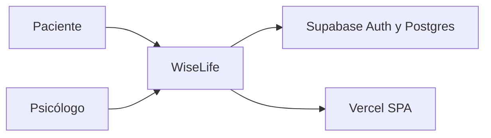
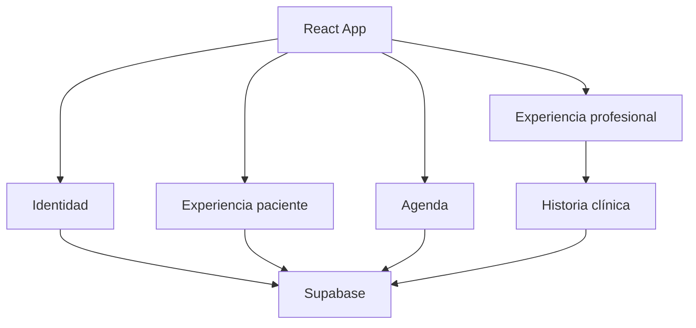
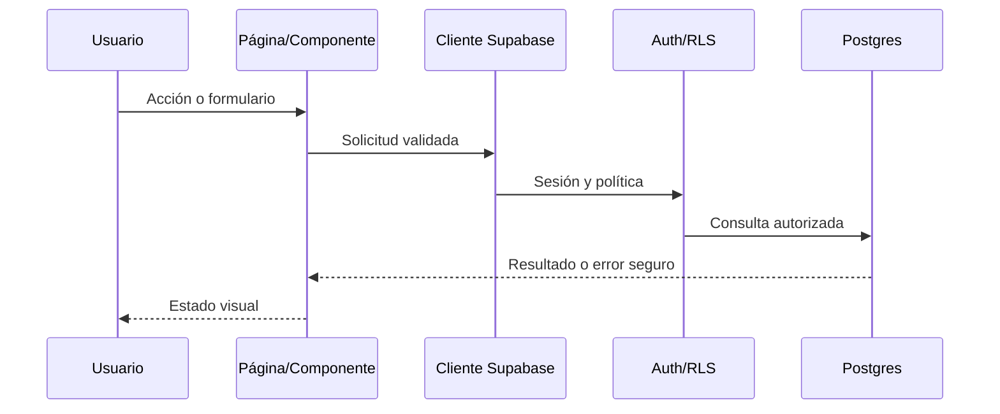
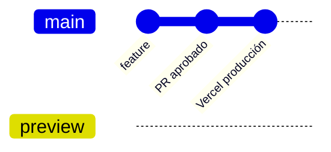
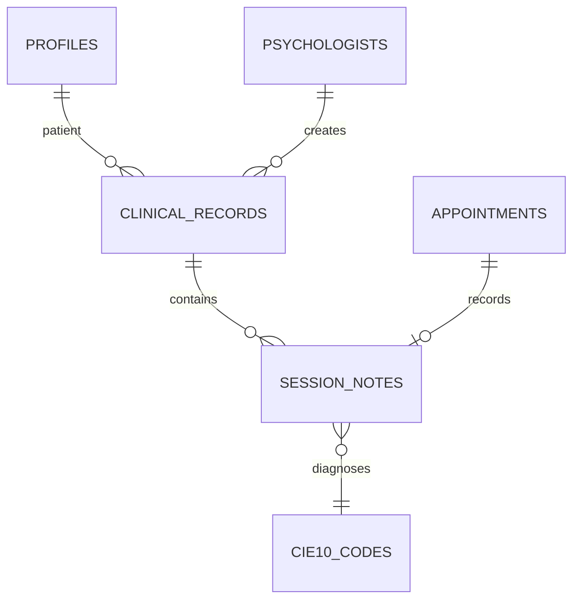

# Diagramas oficiales

Los diagramas representan el estado documentado; no sustituyen el código ni la verificación del esquema vivo.

## Contexto

## Módulos

## Flujo de datos

## Despliegue

## Modelo clínico simplificado

El modelo completo, columnas, índices, triggers y políticas están en `supabase/migrations/20260807000100_wiselife_data_architecture.sql` y en el script histórico de `database/`. Debe verificarse antes de usarlo como contrato productivo.
